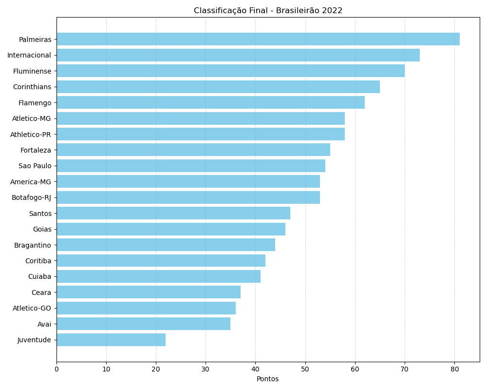
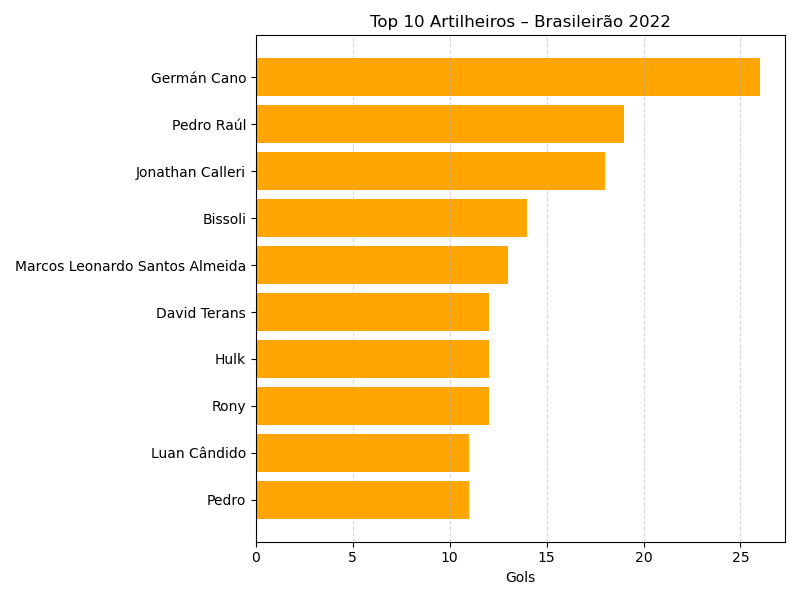

# 📊 Análise do Campeonato Brasileiro 2022

Este projeto explora os dados do Brasileirão 2022 para oferecer insights sobre:

- Classificação final dos times
- Evolução de pontos rodada a rodada
- Ranking de artilheiros

## 🗂️ Estrutura do Projeto

## 🔍 Principais Resultados

### 1. Classificação Final

### 2. Evolução de Pontos (ex: Palmeiras)
*Exemplo de curva de evolução de pontos rodada a rodada.*

### 3. Top 10 Artilheiros

## 🧰 Ferramentas

- Python (Pandas, Matplotlib)
- Jupyter Notebook

---

**Autor:** Diego Juliano Lima Figueredo  
🔗 [LinkedIn](https://www.linkedin.com/in/diego-juliano-lima-figueredo-7112816a/)  

