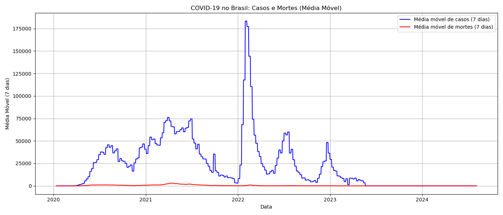

# Análise de Dados da Olist

## 1. Introdução
Este projeto tem como objetivo analisar os dados de pedidos, pagamentos e avaliações da Olist para entender o comportamento dos clientes, logística e satisfação.

## 2. Dados e Metodologia
- Datasets utilizados: orders, payments, reviews, customers, products, entre outros.
- Ferramentas: Python, Pandas, Matplotlib, Jupyter Notebook.

## 3. Análise Exploratória

### 3.1 Status dos Pedidos
- Total de pedidos entregues: 96.478
- Pedidos com atraso: 7,87% do total
- Outros status: shipped, canceled, invoiced, etc.

### 3.2 Tempo Médio de Entrega
- Tempo médio: 12,09 dias
- Tempo mínimo: 0 dias (mesmo dia)
- Tempo máximo: 209 dias (possíveis outliers)

### 3.3 Evolução Mensal dos Pedidos
Gráfico que mostra a quantidade de pedidos por mês, indicando tendências de crescimento e sazonalidade.

### 3.4 Métodos de Pagamento
- Cartão de crédito: 76.795 pedidos
- Boleto bancário: 19.784 pedidos
- Voucher: 5.775 pedidos
- Cartão débito: 1.529 pedidos
- Não definido: 3 pedidos

### 3.5 Avaliações dos Pedidos
- Nota média dos pedidos entregues no prazo: 4,21
- Nota média dos pedidos entregues com atraso: 2,57
- Evidência clara de que atrasos impactam negativamente a satisfação do cliente.

## 4. Conclusão
A análise revelou que a maioria dos pedidos é entregue no prazo, com um tempo médio de entrega de cerca de 12 dias. O cartão de crédito é o método de pagamento mais utilizado. Além disso, atrasos nas entregas estão associados a uma queda significativa na avaliação dos clientes, indicando a importância de melhorias na logística para aumentar a satisfação.

---

## 5. Seção Adicional: Análise de COVID-19 no Brasil

### 5.1 Período Analisado
- **05/01/2020** até **04/08/2024**

### 5.2 Picos da Pandemia
- **Maior pico diário de casos**: 1.283.024 em 30/01/2022  
- **Maior pico diário de mortes**: 21.094 em 04/04/2021  

### 5.3 Médias Móveis de 7 Dias
Para suavizar variações diárias e destacar ondas da pandemia:

- `casos_7d`: média móvel de novos casos  
- `mortes_7d`: média móvel de novas mortes  
- `vacinados_7d`: média móvel de pessoas vacinadas  

#### Gráfico Combinado

**Interpretação**:  
1. Identificam-se três ondas principais:  
   - Abril/2021 (variante Gamma) com pico de mortes.  
   - Janeiro/2022 (variante Ômicron) com pico de casos.  
2. A curva de vacinação (média móvel) acompanha o declínio de mortes nas ondas seguintes, evidenciando o impacto positivo da imunização.

---

*Diego — Análise de Dados & Python*
